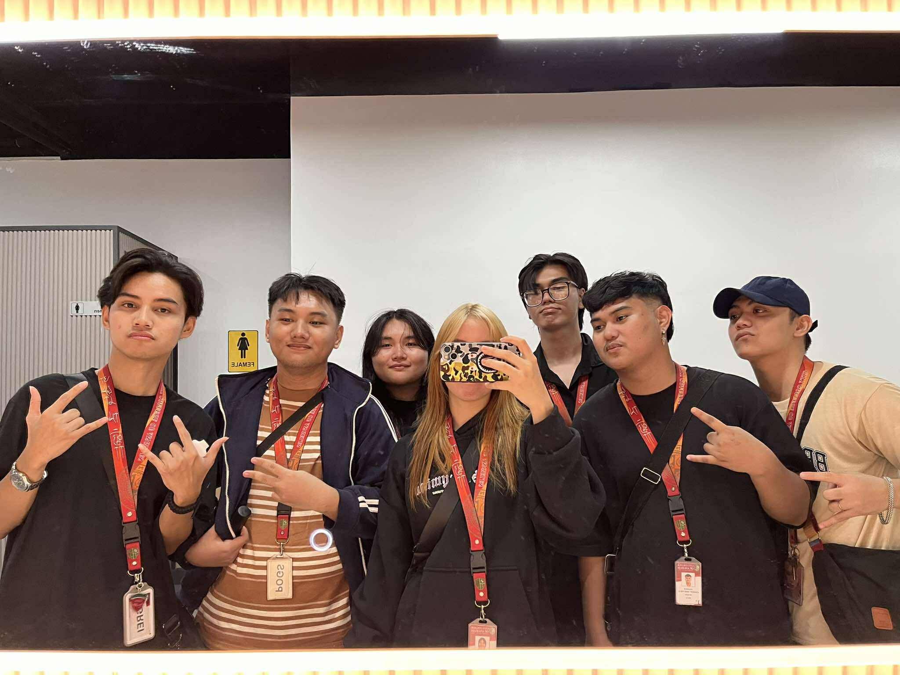

<h1 align="center">Loren Bonillo </h1>

  

<h3 align="center">
👋 Hi, I’m Loren Bonillo, a Computer Science student  from BSCS-C204 at City College of Angeles.
</h3>

<h2 align="left">About Me:</h2>

• 🎨 I enjoy playing FPS games. 
• 🌱 Always curious, always exploring new things. 
• 🥅 2025 Goal: I'm not intimidated by learning new things. 
• 💻 I’m currently learning Python, CSS, and JavaScript. 
• 🎉 Fun fact: I love singing, dancing and playing instruments.

  

<h2 align="left">Areas of Interest, Languages & Tools:</h2>

• 🤖 Artificial Intelligence 
• 🎨 UI/UX Design 
• 🖌️ Graphics Design 
• 🎬 Multimedia 
• 🌐 Web Development 
• 🎮 Game Development

  
  
  
  
  
  
  
  
  
  
  
  
  
  
  
  
  
  
  

<h2 align="left">Projects:</h2>

**Midterms Projects**  
- [Project 1](#) test  
- [Project 2](#) test  

**Finals Projects**  
- [Project 1](#) test  
- [Project 2](#) test  

  
<h2 align="left">Fun Facts About Me:</h2>

• 🤯 I hate math, but I'm here anyway.  
• 🗺️ I’m an ambivert sometimes extroverted, but mostly introverted.   
• 🎮 Playing online games is my hobby.   
• 😌 I'm always here, 24/7 no coffee needed.   
• ☕ Cooking and eating are two of my favorite things.   

<h2 align="left">Connect with Me:</h2>

  <a href="https://discordapp.com/users/578812855193960452" target="_blank">
    
    • I hang out here most of the time, so you can easily reach me.
  </a>  

  <a href="https://www.facebook.com/lorenbonillo">
    
    • I’m always online here, don’t hesitate to drop me a message!
  </a> 

  <a href="https://www.youtube.com/channel/UCeGyIW5X-NfGSvF5SEfdWiw">
    
    • This is where I upload my videos.
  </a>

